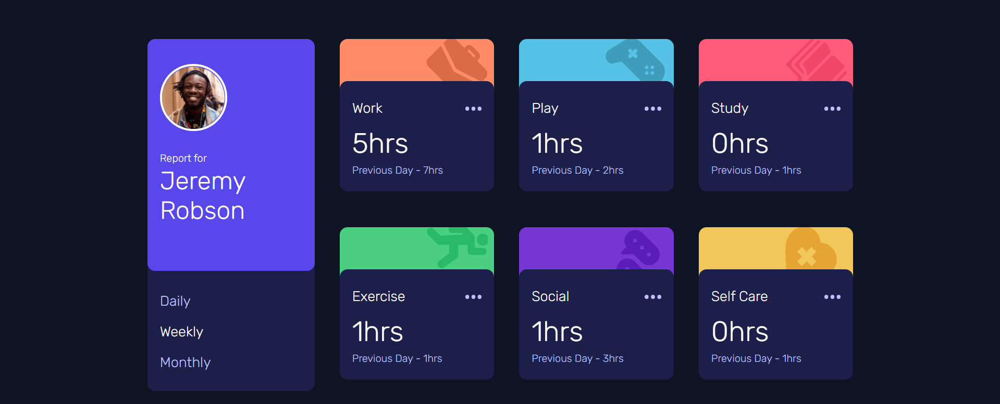

# Frontend Mentor - Time tracking dashboard solution

This is a solution to the [Time tracking dashboard challenge on Frontend Mentor](https://www.frontendmentor.io/challenges/time-tracking-dashboard-UIQ7167Jw). Frontend Mentor challenges help you improve your coding skills by building realistic projects. 

## Table of contents

- [Overview](#overview)
  - [The challenge](#the-challenge)
  - [Screenshot](#screenshot)
  - [Links](#links)
- [My process](#my-process)
  - [Built with](#built-with)
  - [What I learned](#what-i-learned)
  - [Continued development](#continued-development)
- [Author](#author)

## Overview

The challenge is to make a Time Tracking Dashboard, with the hours spent in each area of user's life.

### The challenge

Users should be able to:

- View the optimal layout for the site depending on their device's screen size
- See hover states for all interactive elements on the page
- Switch between viewing Daily, Weekly, and Monthly stats

### Screenshot

### Links

- Solution URL: [Add solution URL here](https://www.frontendmentor.io/solutions/time-tracking-dashboard-gEftDe8XL)
- Live Site URL: [Add live site URL here](https://timetrackerdashboard.netlify.app/)

## My process

### Built with

- Semantic HTML5 markup
- CSS custom properties
- Flexbox
- CSS Grid

### What I learned

In this project I was able to become more familiar with Javascript, since I'm starting my studies in this programming language. I know some choices i made isn't the best way to do the things, but that was the way I found to solve this challenge. But, apart from that, i'm very satisfied with my desing and code.

### Continued development

I'll study more of JSON, Git and the good pratices in JS, so i can write better code every day. Since only the desktop design was done, in the next few days I will be designing for mobile.

## Author

- Github - [@igutzzz](https://github.com/igutzzz)
- Frontend Mentor - [@igutzzz](https://www.frontendmentor.io/profile/igutzzz)
- Twitter - [@heresaguyx](https://twitter.com/heresaguyx)
